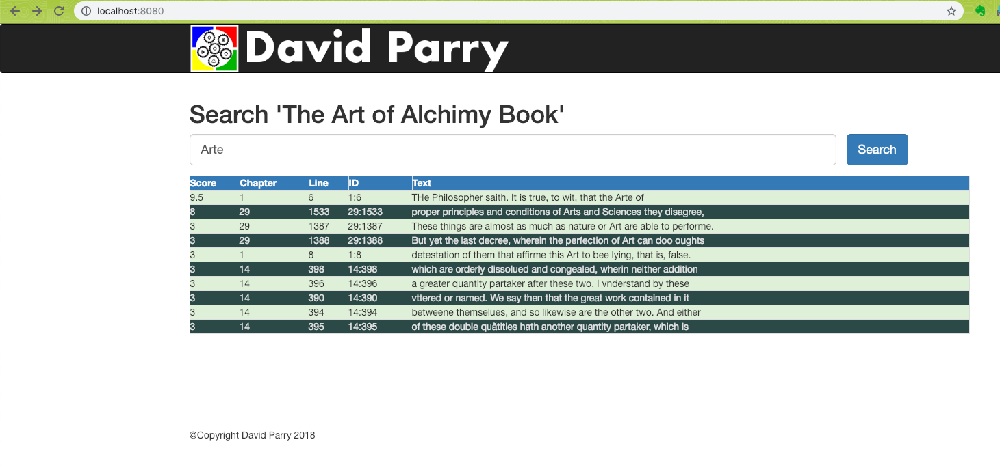

# JRediSearchWorkshop

This project is the output of a workshop showcasing the basic's of JRediSearch Java API

## Getting Started

These instructions will get you a copy of the project up and running on your local machine to follow along during the Workshop talk.

### Prerequisites

- [Docker for Operating System Installed](https://docs.docker.com/ee/end-to-end-install "Link to Docker EE page")
```
$ docker -v
Docker version 18.06.1-ce, build e68fc7a
```
- Pull and start Docker Redisearch Container
```
$ docker run -d  -p 6379:6379 --name redisearch redislabs/redisearch:1.4.0 
{hash} <-- not used indicates success
$ docker logs redisearch
# oO0OoO0OoO0Oo Redis is starting oO0OoO0OoO0Oo 
# .... (removed for brevity) 
* Ready to accept connections

```
- [Gradle Build for Operating System Installed](https://services.gradle.org/distributions/gradle-4.8-all.zip "Gradle Distributions")
```
gradle -v
Welcome to Gradle 4.8!
```
- I prefer Intellij IDEA, you may choose any modern day IDE that can use Gradle to build. 

### Installing
- Clone this Repository
```
git clone git@github.com:davidparry/JRediSearchWorkshop.git
```

## Running the Spock Test Examples

```
./gradlew check
```

## Running the BookDemo Springboot Search Example
* If you want to follow along can check out different tags that are referenced in the presentation [JRediSpringboot.pdf](https://github.com/davidparry/JRediSearchWorkshop/blob/master/JRediSpringboot.pdf)
* Each tag from 7.0 and higher is for the BookDemo Springboot Search Example 
* Feel free to checkout out a tag, gradle check and bootRun

```
git checkout v7.0
./gradlew check bootRun
```

## BookDemo Springboot Search Example



## BookDemo JRediSpringboot Presentation Slides in pdf format
Download [JRediSpringboot.pdf](JRediSpringboot.pdf) the slides stored in this repo.

## Contributing

Please read [CONTRIBUTING.md](CONTRIBUTING.md)  the process for submitting pull requests to me.

## Authors

* **David Parry** -  [David Parry](http://www.davidparry.com)

## License

This project is licensed under the Apache 2 License - see the [LICENSE](LICENSE) file for details

## Acknowledgments

* [Scott Cote](http://www.linkedin.com/in/scottccote) -- for proof reading and working out the examples.
